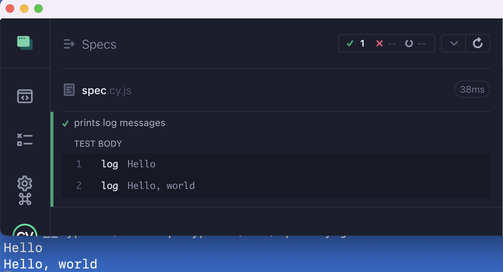

# cypress-log-to-term  [](https://github.com/bahmutov/cypress-log-to-term/actions/workflows/ci.yml)

> Overwrite the `cy.log` command to print to both the Command Log and to the terminal



## Explanation

Read the blog posts 
- [Two Simple Tricks To Make Your Cypress Tests Better](https://glebbahmutov.com/blog/two-cypress-tricks/).
- [Collect All URLs Visited During Cypress Test](https://glebbahmutov.com/blog/collect-tested-urls/)

This plugin is covered in my [Cypress Plugins course](https://cypress.tips/courses/cypress-plugins) 🎓:
- [Lesson a3: Log the messages from the test to the terminal](https://cypress.tips/courses/cypress-plugins/lessons/a3)
- [Lesson a4: Log the messages using the plugin cypress-log-to-term](https://cypress.tips/courses/cypress-plugins/lessons/a4)

## Install

Install this plugin from the NPM registry using NPM or Yarn or your favorite Node package manager.

```text
# Install using NPM
$ npm i -D cypress-log-to-term
# Install using Yarn
$ yarn add -D cypress-log-to-term
```

Include the plugin from your support or spec file

```js
// cypress/e2e/spec.cy.js
// https://github.com/bahmutov/cypress-log-to-term
import 'cypress-log-to-term/commands'
```

Include the plugin from your `cypress.config.js` file's `setupNodeEvents` callback

```js
// cypress.config.js
const { defineConfig } = require('cypress')

module.exports = defineConfig({
  e2e: {
    // baseUrl, etc
    supportFile: false,
    fixturesFolder: false,
    setupNodeEvents(on, config) {
      // register the "cypress-log-to-term" plugin
      // https://github.com/bahmutov/cypress-log-to-term
      // IMPORTANT: pass the "on" callback argument
      require('cypress-log-to-term')(on)
    },
  },
})
```

See [cypress/e2e/spec.cy.js](./cypress/e2e/spec.cy.js)

## Markdown

Markdown bold characters `**` are automatically removed before passing them to the task to be printed.

## Yields the current subject

The `cy.log` yields the current subject to the next command, because [it should](https://glebbahmutov.com/blog/better-cypress-log/).

```js
cy.wrap(42).log().should('equal', 42)
```

## Format string

This plugins adds format string and format callback function feature to the `cy.log` command. For example, the "standard" `cy.log` command could only print a string argument

```js
cy.wrap({ name: 'Joe' }).log('the name')
// prints "the name"
```

This module allows you to print the current subject

```js
cy.wrap({ name: 'Joe' }).log()
// prints '{"name":"Joe"}'
```

Complex objects are supported

```js
cy.wrap([1, 'hello', { name: 'Joe' }]).log()
// prints '[1,"hello",{"name":"Joe"}]'
```

You can add a string argument and insert the formatted subject into it

```js
cy.wrap({ name: 'Joe' }).log('person is %o')
// prints 'person is {"name":"Joe"}'
```

This is equivalent to `{0}` notation

```js
cy.wrap({ name: 'Joe' }).log('person is {0}')
// prints 'person is {"name":"Joe"}'
```

You can even access the properties of the subject

```js
cy.wrap({ name: 'Joe' }).log('my name is {0.name}')
// prints 'my name is Joe'
```

Deep properties are allowed

```js
cy.wrap([{ name: 'Joe' }, { name: { first: 'Anna' } }])
  // from the subject (accessed via {0})
  // grab the property "1" (which is the second item in our array)
  // then grab the path "name.first"
  .log('her name is {0.1.name.first}')
// prints 'her name is Anna'
```

## Format callback

You can pass a callback function to the overwritten `cy.log` command. This way you can return a formatted string given the subject value.

```js
const person = { name: 'Joe' }
cy.wrap(person).log((p) => `name is ${p.name}`)
// prints 'name is Joe'
cy.wrap([1, 2, 3]).log((list) => list[1])
// prints "2"
```

If you return non-string result, `cy.log` will try its best to serialize it

```js
cy.wrap({ name: 'Me' }).log((x) => x) // {"name":"Me"}
```

## Circular objects

If the subject to be serialized has circular references, they are safely converted to string

```js
const obj = {
  name: 'object',
}
obj.next = obj
// try to log a circular object
cy.wrap(obj, { log: false }).log()
// {"name":"object","next":"[Circular]"}
```

See [circular.cy.js](./cypress/e2e/circular.cy.js)

## jQuery / DOM elements

Are serialized with main properties (id, class, attributes) and the number of matched elements

```html
<h1 id="title">Hello</h1>
```

```js
cy.get('h1').log()
// $ of 1 <div#obj.my-object/>
```

If there are a lot of yielded elements, only the first and the last one are logged

```html
<ol id="people">
  <li class="first">one</li>
  <li>two</li>
  <li>three</li>
  <li>four</li>
  <li class="last">five</li>
</ol>
```

```js
cy.get('#people li').log()
// $ of 5 [<li.first/>...<li.last/>]
```

**Note:** when serializing, the log respects the `chai.config.truncateThreshold` setting. To log more info, increase it in your spec or support file:

```html
<p class="some-class" data-cy="para" data-test="my-p">Test page</p>
```

```js
cy.get('#people li').log()
// default
// $ of 1 <p.some-class data-cy=para data-t...
// with chai.config.truncateThreshold = 200
// $ of 1 <p.some-class data-cy=para data-test=my-p/>
```

**Tip:** use the format string to better explain what the elements are

```js
cy.get('#people li').log('list of people %o')
// list of people $ of 5 [<li.first/>...<li.last/>]
```

See [dom.cy.js](./cypress/e2e/dom.cy.js)

## Types

This package includes TypeScript command definitions for its custom commands in the file [src/index.d.ts](./src/index.d.ts). To use it from your JavaScript specs:

```js
/// <reference types="cypress-log-to-term" />
```

If you are using TypeScript, include this module in your types list

```json
{
  "compilerOptions": {
    "types": ["cypress", "cypress-log-to-term"]
  }
}
```

## Small print

Author: Gleb Bahmutov &lt;gleb.bahmutov@gmail.com&gt; &copy; 2022

- [@bahmutov](https://twitter.com/bahmutov)
- [glebbahmutov.com](https://glebbahmutov.com)
- [blog](https://glebbahmutov.com/blog)
- [videos](https://www.youtube.com/glebbahmutov)
- [presentations](https://slides.com/bahmutov)
- [cypress.tips](https://cypress.tips)
- [Cypress Tips & Tricks newsletter](https://cypresstips.substack.com/)

License: MIT - do anything with the code, but don't blame me if it does not work.

Support: if you find any problems with this module, email / tweet /
[open issue](https://github.com/bahmutov/cypress-log-to-term/issues) on Github

## MIT License

Copyright (c) 2022 Gleb Bahmutov &lt;gleb.bahmutov@gmail.com&gt;

Permission is hereby granted, free of charge, to any person
obtaining a copy of this software and associated documentation
files (the "Software"), to deal in the Software without
restriction, including without limitation the rights to use,
copy, modify, merge, publish, distribute, sublicense, and/or sell
copies of the Software, and to permit persons to whom the
Software is furnished to do so, subject to the following
conditions:

The above copyright notice and this permission notice shall be
included in all copies or substantial portions of the Software.

THE SOFTWARE IS PROVIDED "AS IS", WITHOUT WARRANTY OF ANY KIND,
EXPRESS OR IMPLIED, INCLUDING BUT NOT LIMITED TO THE WARRANTIES
OF MERCHANTABILITY, FITNESS FOR A PARTICULAR PURPOSE AND
NONINFRINGEMENT. IN NO EVENT SHALL THE AUTHORS OR COPYRIGHT
HOLDERS BE LIABLE FOR ANY CLAIM, DAMAGES OR OTHER LIABILITY,
WHETHER IN AN ACTION OF CONTRACT, TORT OR OTHERWISE, ARISING
FROM, OUT OF OR IN CONNECTION WITH THE SOFTWARE OR THE USE OR
OTHER DEALINGS IN THE SOFTWARE.
